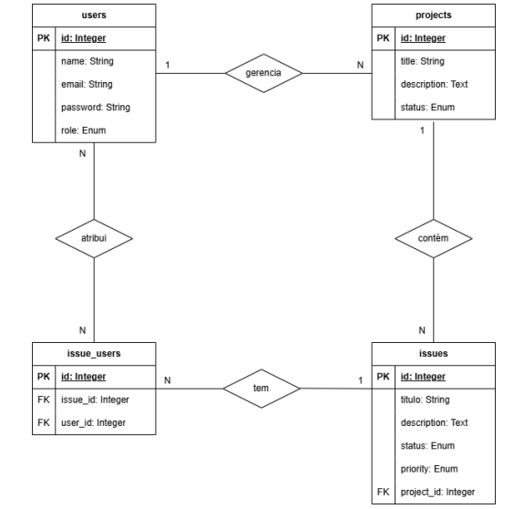

Objetivo do Projeto:

Desenvolver um sistema web que permita a gestão eficiente de projetos e suas respectivas issues (problemas ou tarefas). Este sistema será utilizado para organizar e acompanhar o progresso de diferentes projetos dentro de uma equipe, facilitando a comunicação e a colaboração entre os membros.

Funcionalidades:
1. Cadastro de Usuários:
- [x] Os usuários devem ser capazes de se registrar e fazer login no sistema.
- [x] Cada usuário terá um perfil com suas informações básicas, de acordo com o breeze.
2. Gestão de projetos:
- [x] Os usuários autenticados poderão criar novos projetos, fornecendo um título, descrição e
  data de início e término.
- [x] Cada projeto deve ter um responsável (owner) e pode ter múltiplos membros associados.
3. Gestão de issues:
- [x] Dentro de cada projeto, os usuários poderão criar, visualizar e gerenciar issues.
- [x] Cada issue deve conter um título, descrição, prioridade (alta, média, baixa) e status (aberta,
  em andamento, fechada).
- [x] As issues devem ser atribuídas a um ou mais usuários do projeto.
- [x] Os usuários poderão atribuir issues a si mesmos ou a outros membros do projeto.
4. Painel de Visualização:
- [x] O sistema deve oferecer um painel de visualização geral, onde os usuários podem ver os
  projetos e issues de forma organizada.
- [x] Filtros e buscas devem estar disponíveis para facilitar a localização de projetos e issues
  específicos.
5. MER do projeto
   O banco de dados do projeto deverá ser baseado no MER fornecido abaixo, podendo
   haver adições a critério do aluno.

